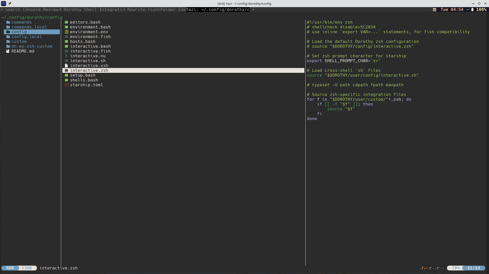
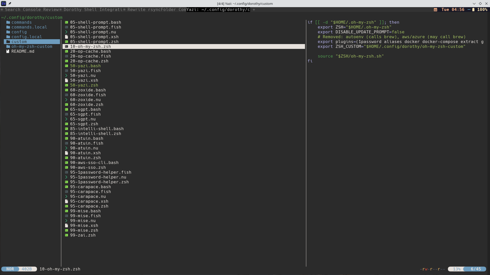

**Part 1 of 3: The Dorothy Configuration Series**

This is the first installment in a three-part series exploring how I use [Dorothy](https://github.com/bevry/dorothy) to manage my shell configuration across multiple shells and operating systems. In this series, I'll walk through my journey from dotfile chaos to a portable, maintainable system.

**Series Overview:**

- **Part 1:** [Taming the Dotfile Chaos with Dorothy](/posts/2026/2026-01-05-dorothy-series-part-1-taming-dotfile-chaos-with-dorothy/) - Introduction and core concepts (this post)
- **Part 2:** [Secrets Management with 1Password](/posts/2026/2026-01-05-dorothy-series-part-2-secrets-management-with-1password/) - Safe environment variable handling
- **Part 3:** [AI-Powered Shell Commands with Shell-GPT](/posts/2026/2026-01-05-dorothy-series-part-3-ai-powered-shell-commands-with-shell-gpt/) - Natural language shell integration

---

*This post was written with AI assistance (Claude) for structure, formatting, and information gathering. The ideas, direction, and voice are my own.*

Let me start with a confession:

> **My dotfiles were a disaster.**

I'm talking about a sprawling mess of `.bashrc` hacks accumulated over years, platform-specific conditionals nested three layers deep, and that one alias I added in 2019 that I'm afraid to remove because something might break. You know the type.

Then I discovered [Dorothy](https://github.com/bevry/dorothy).

## The Problem with Traditional Dotfiles

If you've ever tried to sync your shell configuration across machines, you know the pain. Your carefully crafted `.zshrc` works perfectly on your Linux workstation, but then you ssh into a Mac and suddenly half your aliases break because BSD `sed` isn't GNU `sed`. Or you try Fish shell for a week and realize you'd have to rewrite everything in a completely different syntax.

The traditional solutions all have tradeoffs:

- **Symlink farms**: Work fine until you need platform-specific behavior
- **Git bare repos**: Clever, but still doesn't solve the cross-shell problem
- **Stow**: Great for organization, but you're still writing platform-specific code

What I really wanted was a system that would let me write a configuration once and have it work everywhere — across shells, across operating systems, across architectures.

## Enter Dorothy

Dorothy describes itself as a "dotfile ecosystem," which is accurate but undersells it. It's really a framework for building portable shell configurations that abstracts away the differences between Bash, Zsh, Fish, NuShell, and even more exotic shells like Xonsh.

The philosophy is simple: solve a problem once, for all shells and platforms. Dorothy provides the plumbing so you can focus on your actual customizations.

Here's how I've structured my Dorothy configuration:

```
~/.config/dorothy/
├── commands/           # 60+ custom commands
├── config/             # Cross-shell configuration
├── config.local/       # Machine-specific secrets (git-ignored)
├── custom/             # Shell-specific customizations (numbered priority)
└── oh-my-zsh-custom/   # ZSH plugins via git submodules
```

## The Multi-Shell Magic

The real beauty of Dorothy is how it handles multiple shells. I primarily use Zsh, but I've been experimenting with NuShell for certain workflows. With Dorothy, I can set my shell preferences in a single file:

```bash
# config/shells.bash
DOROTHY_SHELLS=(
    zsh
    bash
    fish
    xonsh
    nu
)
```

When I open a terminal, Dorothy loads the appropriate configuration for whichever shell I'm using. My common environment variables, PATH modifications, and shared settings work everywhere. Shell-specific customizations go in their own files:

```bash
config/interactive.bash  # Bash-specific (vi mode, globstar)
config/interactive.zsh   # ZSH-specific (oh-my-zsh, plugins)
config/interactive.fish  # Fish-specific syntax
config/interactive.nu    # NuShell configuration
```

This means I can write my core configuration once, then add shell-specific enhancements where needed. When I decided to try NuShell, I didn't have to start from scratch — I just added `config/interactive.nu` with the Nu-specific bits.



Here's what my `config/` folder looks like in practice. On the left you can see the top-level Dorothy structure, in the middle the various `interactive.*` files for each shell, and on the right the contents of `interactive.zsh` — which loads Dorothy's defaults and then sources any zsh-specific customizations from the `custom/` folder.

## Numbered Custom Scripts

I use a numbered prefix system for loading scripts in a specific order. My `custom/` directory looks like this:

```
custom/
├── 05-shell-prompt.bash       # Defines prompt character per shell
├── 20-op-cache.bash           # 1Password variable caching
├── 50-yazi.bash               # File manager integration
├── 60-zoxide.bash             # Smart cd replacement
├── 65-sgpt.zsh                # Shell-GPT Ctrl-O keybinding
├── 90-atuin.bash              # Command history syncing
├── 95-carapace.bash           # Universal completions
└── 99-mise.bash               # Runtime version manager
```

The numbers control loading order. Early scripts (05) set up foundational things like prompt characters. Later scripts (99) initialize tools that depend on earlier configuration. This explicit ordering eliminates the "which file loads first?" debugging sessions that plague traditional dotfile setups.



Here's the `custom/` folder in action. Notice how each script has a numeric prefix controlling load order. On the right, you can see `10-oh-my-zsh.zsh` — this is how I integrate oh-my-zsh into Dorothy, pointing it to my custom plugins directory while letting Dorothy manage the overall shell initialization.

## Cross-Platform Tool Installation

Dorothy includes a powerful setup system. In `config/setup.bash`, I define all the tools I want available:

```bash
SETUP_UTILS=(
    # Modern CLI replacements
    bat       # cat with syntax highlighting
    eza       # ls replacement
    fd        # find replacement
    ripgrep   # grep replacement
    delta     # Better git diffs

    # Development
    gh        # GitHub CLI
    lazygit   # Git TUI
    mise      # Runtime version manager

    # Shell enhancements
    starship  # Cross-shell prompt
    zoxide    # Smart directory jumping
    fzf       # Fuzzy finder
    atuin     # Shell history sync
)
```

When I run `setup-system`, it installs everything appropriate for my platform. On my Arch Linux machine, it uses `pacman`. On a Mac, it would use `brew`. The abstraction handles the platform differences so I don't have to think about them.

I can also define platform-specific packages:

```bash
# Arch Linux only (via AUR)
AUR_INSTALL=(
    jless
    yq-go
)

# Linux Flatpaks
FLATPAK_INSTALL=(
    us.zoom.Zoom
    com.getpostman.Postman
)

# Python tools via uv
UV_INSTALL=(
    ruff
)
```

## Custom Commands

Dorothy makes it dead simple to add custom commands that work across shells. Any executable in `commands/` becomes available system-wide. Here's my `rsyncFolder` command that fires off rsync to copy a folder to /tmp:

```bash
#!/usr/bin/env bash

function rsync_folder() (
    source "$DOROTHY/sources/bash.bash"

    # =====================================
    # Arguments

    # help
    function help {
        cat <<-EOF >&2
            ABOUT:
            Rsync a source directory to a destination directory with sensible defaults.
            Excludes common development directories (.git, node_modules, etc.).

            USAGE:
            rsyncFolder <source> <destination>

            OPTIONS:
            <source>
                The source directory to copy from.

            <destination>
                The destination directory to copy to.
                Will be created if it doesn't exist, or replaced if it does.
EOF
        if [[ $# -ne 0 ]]; then
            __print_error "$@"
        fi
        return 22 # EINVAL 22 Invalid argument
    }

    # process
    local item option_source='' option_destination=''
    while [[ $# -ne 0 ]]; do
        item="$1"
        shift
        case "$item" in
        '--help' | '-h') help ;;
        '--source='*) option_source="${item#*=}" ;;
        '--destination='*) option_destination="${item#*=}" ;;
        '--'*) help 'An unrecognised flag was provided:' --variable-value="$item" ;;
        *)
            if [[ -z $option_source ]]; then
                option_source="$item"
            elif [[ -z $option_destination ]]; then
                option_destination="$item"
            else
                help 'An unrecognised argument was provided:' --variable-value="$item"
            fi
            ;;
        esac
    done

    # validate
    if [[ -z $option_source ]]; then
        help 'Missing required argument: <source>'
    fi
    if [[ -z $option_destination ]]; then
        help 'Missing required argument: <destination>'
    fi

    # =====================================
    # Action

    # Ensure destination directory exists (remove if present, then create)
    if [[ -e $option_destination ]]; then
        rm -rf "$option_destination"
    fi
    mkdir -p "$option_destination"

    # Perform rsync
    rsync -armR --info=progress2 \
        --exclude='.esbuild' \
        --exclude='.jest' \
        --exclude='.history' \
        --exclude='.pnpm-store' \
        --exclude='node_modules/' \
        --exclude='.tmp/' \
        --exclude='.git/' \
        --exclude='.webpack/' \
        --exclude='.serverless/' \
        --exclude='coverage/' \
        --delete \
        --checksum \
        --stats \
        --human-readable \
        "$option_source" "$option_destination"
)

# fire if invoked standalone
if [[ $0 == "${BASH_SOURCE[0]}" ]]; then
    rsync_folder "$@"
fi

```

I've got about 60 commands covering everything from AWS profile switching to tmux session management to project scaffolding. The beauty of Dorothy is that if you name your commands the same as theirs, yours take precedence.  For example, I overrode how they managed node, since I use `mise` instead of their default `nvm`:

Some examples:

- **`setup-node`**: Installs Node.js via mise with version fallbacks
- **`setup-util-docker`**: Fixed for Manjaro/Arch: use pacman instead of get.docker.com (which doesn't support Manjaro)

## Starship: One Prompt to Rule Them All

Since Dorothy supports multiple shells, it makes sense to use a cross-shell prompt. I use [Starship](https://starship.rs/) with a comprehensive configuration:

```toml
# config/starship.toml
format = """
$os\
$username\
$directory\
$git_branch$git_status\
$nodejs$python$rust$go\
$cmd_duration\
$line_break\
$character"""

[character]
success_symbol = "[❯](green)"
error_symbol = "[❯](red)"

[directory]
truncation_length = 3
truncate_to_repo = true

[git_branch]
format = "[$symbol$branch]($style) "

[cmd_duration]
min_time = 2_000
format = "took [$duration](yellow) "
```

This gives me a consistent, informative prompt whether I'm in Zsh, Bash, Fish, or NuShell. The prompt shows my current directory, git status, active language runtimes, and command duration — all without shell-specific configuration.

## The Migration Experience

The beauty of Dorothy is how it forced me to establish standards. When I migrated my old configurations, I had to think about what was actually essential versus what was platform-specific cruft.

My old `.bashrc` had this gem:

```bash
# No idea what this does but things break without it
if [ -f /etc/bash_completion ] && ! shopt -oq posix; then
    . /etc/bash_completion
fi
# Added 2017, scared to remove - Mike
```

With Dorothy, I either understood a configuration well enough to port it properly, or I realized I didn't need it. The forced cleanup was therapeutic.

Now when I set up a new machine, the process is:

1. Install Dorothy
2. Clone my config repo to `~/.config/dorothy`
3. Run `dorothy setup` and `setup-system`
4. Authenticate with 1Password

That's it. Within minutes, I have my complete development environment — all my tools, all my aliases, all my customizations. The same config works on my Arch Linux workstation, would work on a MacBook, and could even run on Windows via WSL.

## Is It Worth It?

If you're happy with a single shell on a single platform, Dorothy might be overkill. But if you:

- Work across multiple operating systems
- Want to experiment with different shells without rewriting configs
- Value reproducible development environments
- Are tired of debugging platform-specific shell issues

...then Dorothy is worth the investment. The initial setup takes some time as you port your existing configurations, but the payoff is a system that just works, everywhere.

My dotfiles used to be something I dreaded touching. Now they're a well-organized, version-controlled system that I actually enjoy maintaining. That's a transformation I didn't expect from a dotfile manager.

---

You can find Dorothy at [github.com/bevry/dorothy](https://github.com/bevry/dorothy). My personal Dorothy configuration is available at [github.com/drmikecrowe/dorothy-config](https://github.com/drmikecrowe/dorothy-config.git) if you want to see a real-world example. Feel free to steal anything useful.
