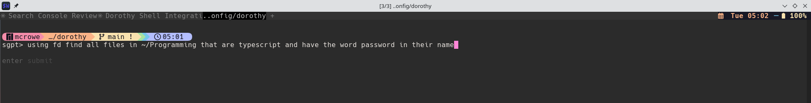

**Part 3 of 3: The Dorothy Configuration Series**

This is the final installment in a three-part series exploring how I use [Dorothy](https://github.com/bevry/dorothy) to manage my shell configuration across multiple shells and operating systems. In this post, I'll show you how I integrated AI-powered command generation directly into my shell workflow.

**Series Overview:**

- **Part 1:** [Taming the Dotfile Chaos with Dorothy](/posts/2026/2026-01-05-dorothy-series-part-1-taming-dotfile-chaos-with-dorothy/) - Introduction and core concepts
- **Part 2:** [Secrets Management with 1Password](/posts/2026/2026-01-05-dorothy-series-part-2-secrets-management-with-1password/) - Safe environment variable handling
- **Part 3:** [AI-Powered Shell Commands with Shell-GPT](/posts/2026/2026-01-05-dorothy-series-part-3-ai-powered-shell-commands-with-shell-gpt/) - Natural language shell integration (this post)

---

*This post was written with AI assistance (Claude) for structure, formatting, and information gathering. The ideas, direction, and voice are my own.*

## TL;DR



The output from the prompt above:

```bash
z> fd 'password' ~/Programming -e ts --type f  # using fd find all files in ~/Programming that are typescript and have the word password in their name
/home/mcrowe/Programming/Personal/pulumi/obsidian/node_modules/@pulumi/aws/iam/accountPasswordPolicy.d.ts
/home/mcrowe/Programming/Personal/pulumi/obsidian/node_modules/@pulumi/aws/secretsmanager/getRandomPassword.d.ts
```

## The Problem

Have you ever found yourself staring at the terminal, knowing *exactly* what you want to do, but unable to remember the exact incantation to make it happen?

"Find all files modified in the last 24 hours that contain the word 'error'..."

I know it involves `find` and `grep` somehow. Maybe `-mtime`? Or was it `-mmin`? And what's that flag for executing grep on each result... `-exec`? With the curly braces and the semicolon? Do I need to escape the semicolon?

By the time I've googled it, tested three variations, and finally got it right, five minutes have evaporated. And next week? I'll have forgotten it all over again.

## Enter Shell-GPT

[Shell-GPT](https://github.com/TheR1D/shell_gpt) is a command-line tool that lets you ask AI to generate shell commands in plain English. You can install it with pip:

```bash
pip install shell-gpt
```

Out of the box, you'd use it like this:

```bash
nu>  sgpt --shell "find files modified in last 24 hours containing 'error' in the current folder"
find . -type f -mtime -1 -exec grep -l 'error' {} +
[E]xecute, [D]escribe, [A]bort: e
./custom/90-atuin.nu
./commands/rsyncFolder
```

That's great. But I wanted something more integrated. I didn't want to type `sgpt --shell "..."` every time. I wanted to hit a key, type my intent, and have the command appear—ready to run or edit—right on my command line.

## The Integration: Ctrl+O Everything

Dorothy's `custom` folder lets you add shell-specific configuration files that get sourced on startup. Files are named with a numeric prefix to control load order (higher numbers load later), followed by a description and the shell extension.

I created `65-sgpt.*` files for each shell I use: Bash, Zsh, Fish, and Nushell. They all do the same thing:

1. **Ctrl+O** triggers the integration
2. If there's text on the command line, it's used as the prompt (treating it as a natural language description)
3. If the line is empty, a prompt pops up asking what you want to do
4. The AI-generated command replaces your input, with your original prompt preserved as a trailing comment

Here's what it looks like in action:

<video controls width="100%" style="max-width: 800px;">
  <source src="images/Screencast_20260106_044849.webm" type="video/webm">
  Your browser does not support the video tag.
</video>

Let's walk through each implementation.

### Bash: `custom/65-sgpt.bash`

```bash
# Shell-GPT integration BASH v0.2
[[ $- == *i* ]] || return

_sgpt_bash() {
    local _sgpt_prev_cmd=""
    # Strip leading spaces and # from command line
    local _sgpt_cmd="${READLINE_LINE#"${READLINE_LINE%%[![:space:]#]*}"}"

    if [[ -n "$_sgpt_cmd" ]]; then
        _sgpt_prev_cmd="$_sgpt_cmd"
        READLINE_LINE+="⌛"
    elif [[ -n "$(command -v gum)" ]]; then
        _sgpt_prev_cmd=$(gum input --placeholder="What can I help you with" --prompt="sgpt> ")
    else
        echo -n "sgpt> "
        read -r _sgpt_prev_cmd
    fi

    # Return if still no prompt
    [[ -z "$_sgpt_prev_cmd" ]] && return

    local _sgpt_result
    if _sgpt_result=$(sgpt --shell --no-interaction <<<"$_sgpt_prev_cmd"); then
        # Trim whitespace and append original as comment
        _sgpt_result="${_sgpt_result#"${_sgpt_result%%[![:space:]]*}"}"
        _sgpt_result="${_sgpt_result%"${_sgpt_result##*[![:space:]]}"}"
        READLINE_LINE="$_sgpt_result  # $_sgpt_prev_cmd"
    else
        READLINE_LINE="${READLINE_LINE%⌛}  # ERROR: sgpt command failed"
    fi
    READLINE_POINT=${#READLINE_LINE}
}
bind -x '"\C-o": _sgpt_bash'
```

The key bits:
- `[[ $- == *i* ]] || return` — Only run in interactive shells
- `READLINE_LINE` — Bash's variable for the current command line contents
- The hourglass emoji (`⌛`) provides visual feedback while waiting for the API
- If [gum](https://github.com/charmbracelet/gum) is installed, you get a prettier input prompt
- The original natural language prompt is preserved as a `# comment` at the end

### Zsh: `custom/65-sgpt.zsh`

```zsh
# Shell-GPT integration ZSH v0.2
[[ -o interactive ]] || return

_sgpt_zsh() {
    local _sgpt_prev_cmd=""
    # Strip leading spaces and # from command line
    local _sgpt_cmd="${BUFFER##[[:space:]#]#}"

    if [[ -n "$_sgpt_cmd" ]]; then
        _sgpt_prev_cmd="$_sgpt_cmd"
        BUFFER+="⌛"
    elif [[ -n "$(command -v gum)" ]]; then
        _sgpt_prev_cmd=$(gum input --placeholder="What can I help you with" --prompt="sgpt> ")
    else
        echo -n "sgpt> "
        read -r _sgpt_prev_cmd
    fi

    # Return if still no prompt
    [[ -z "$_sgpt_prev_cmd" ]] && return

    zle -I && zle redisplay

    local _sgpt_result
    if _sgpt_result=$(sgpt --shell <<< "$_sgpt_prev_cmd" --no-interaction); then
        # Trim whitespace and append original as comment
        BUFFER="${${_sgpt_result## #}%% #}  # $_sgpt_prev_cmd"
    else
        BUFFER="${BUFFER%⌛}  # ERROR: sgpt command failed"
    fi
    zle end-of-line
}
zle -N _sgpt_zsh
bindkey ^o _sgpt_zsh
```

Zsh uses `BUFFER` instead of `READLINE_LINE`, and the keybinding setup is a bit different (`zle -N` to register the widget, `bindkey` to map it).

### Fish: `custom/65-sgpt.fish`

```fish
# Shell-GPT integration Fish v0.2
status is-interactive || exit

function _sgpt_fish
    set -l prev_cmd ""
    # Get current command line, stripping leading spaces and #
    set -l cmd (commandline | string replace -r '^[ #]+' '')

    if test -n "$cmd"
        set prev_cmd $cmd
        commandline -a "⌛"
        commandline -f end-of-line
    else if command -q gum
        set prev_cmd (gum input --placeholder="What can I help you with" --prompt="sgpt> ")
    else
        read -P "sgpt> " prev_cmd
    end

    # Return if still no prompt
    if test -z "$prev_cmd"
        return
    end

    set -l result (echo "$prev_cmd" | sgpt --role fish_generator --shell --no-interaction)

    if test $status -eq 0
        commandline -r -- (string trim "$result")
        commandline -a "  # $prev_cmd"
    else
        commandline -f backward-delete-char
        commandline -a "  # ERROR: sgpt command failed"
    end
    commandline -f end-of-line
end

bind \co _sgpt_fish
```

Fish has its own way of doing everything, but the logic is the same. Notice `--role fish_generator` in the sgpt call—I have a custom role defined that tells Shell-GPT to generate Fish-specific syntax. Fish's scripting language differs enough from Bash/Zsh that this makes a real difference.

### Nushell: `custom/65-sgpt.nu`

```nu
# Shell-GPT integration Nushell v0.1
# Add this to your config.nu

# Define the sgpt command handler
def --env shell-gpt [] {
    # Get current command line, strip leading spaces and #
    let current = (commandline | str trim --left --char ' ' | str trim --left --char '#')

    let prompt = if ($current | is-not-empty) {
        # Show loading indicator
        commandline edit --append "⌛"
        $current
    } else if (which gum | is-not-empty) {
        # Use gum for interactive input if available
        ^gum input --placeholder="What can I help you with" --prompt="sgpt> "
    } else {
        # Fall back to basic input
        input "sgpt> "
    }

    # Return if still no prompt
    if ($prompt | is-empty) {
        commandline edit --replace ""
        return
    }

    # Call sgpt and handle result
    let result = try {
        $prompt | ^sgpt --role nushell_generator --shell --no-interaction | str trim
    } catch {
        null
    }

    if ($result != null) {
        commandline edit --replace $"($result)  # ($prompt)"
    } else {
        let cleaned = (commandline | str replace "⌛" "")
        commandline edit --replace $"($cleaned)  # ERROR: sgpt command failed"
    }
}

# Add keybinding for Ctrl+O
# Merge this into your existing $env.config.keybindings
$env.config.keybindings = ($env.config.keybindings | append {
    name: sgpt_shell
    modifier: control
    keycode: char_o
    mode: [emacs vi_normal vi_insert]
    event: {
        send: executehostcommand
        cmd: "shell-gpt"
    }
})
```

Nushell's version is the most verbose because keybindings have to be configured declaratively. But it's also the cleanest to read—Nushell's structured approach to shell scripting really shines here. Like Fish, I use a custom `nushell_generator` role so the AI knows to output Nushell syntax.

## Why This is Useful

I've been using this setup for a while now, and it's genuinely changed how I interact with the terminal.

### No More Syntax Lookup

The most obvious benefit: I don't google command syntax anymore. Instead of:

```bash
# What was the tar extract flag again...
tar -xvf archive.tar.gz
# No wait, that's for .tar, for .tar.gz it's...
tar -xzvf archive.tar.gz
```

I just type `extract archive.tar.gz` and hit Ctrl+O.

### Learning Tool

Because the original prompt is preserved as a comment, I can see what I asked for next to the actual command. Over time, I've actually *learned* the syntax for commands I use frequently—the AI-generated commands serve as instant documentation.

```bash
find . -type f -name "*.log" -mtime +7 -delete  # delete log files older than a week
```

I've run that enough times now that I could probably write it myself. Probably.

### Complex Pipelines Made Easy

This is where it really shines. Multi-step pipelines that would take me several tries to get right:

```
# Prompt: "find the 10 largest files in current directory recursively, show size in human readable format"
z>  find . -type f -exec du -h {} + | sort -rh | head -n 10  # find the 10 largest files in current directory recursively, show size in human readable format
592K    ./oh-my-zsh-custom/plugins/zsh-autosuggestions/.git/objects/pack/pack-8cc7602f971e1ec70d3000f8a010ea6186a0d490.pack
100K    ./oh-my-zsh-custom/plugins/autoenv/.git/objects/pack/pack-82336c6b2dd7407f4720132f9df75d1dc263da74.pack
72K     ./oh-my-zsh-custom/plugins/zsh-autosuggestions/.git/objects/pack/pack-8cc7602f971e1ec70d3000f8a010ea6186a0d490.idx
36K     ./oh-my-zsh-custom/plugins/autoenv/LICENSE
28K     ./oh-my-zsh-custom/plugins/zsh-autosuggestions/zsh-autosuggestions.zsh
```

```
# Prompt: "count lines of code in all shell scripts, excluding git files"
z>  find . -type f -name "*.sh" ! -path "./.git/*" -exec cat {} + | wc -l  # count lines of code in all shell scripts, excluding git files
106
```

I probably would have figured these out eventually, but Ctrl+O gets me there in seconds.

### Context-Aware Suggestions

Because your current command line content is used as the prompt, you can start typing and then ask for help:

```
# Type this on command line:
git log --

# Hit Ctrl+O, and it might suggest:
git log --pretty=format:"%h - %an, %ar : %s"  # git log --
```

The AI sees `git log --` and infers you want common useful flags.

## The Gum Enhancement

You might have noticed all four implementations check for [gum](https://github.com/charmbracelet/gum). This is a delightful CLI tool from Charm that provides beautiful terminal UI components. When installed, instead of a bare `sgpt> ` prompt, you get a properly styled input field with placeholder text.

It's a small touch, but it makes the experience feel more polished. If you're not familiar with Charm's tools, they're worth checking out—they make building beautiful CLI apps surprisingly easy.

## Setting Up Shell-GPT Roles

For Fish and Nushell, I mentioned custom roles. These are configured in Shell-GPT's config. Here's an example role for Fish:

```json
{
  "name": "fish_generator",
  "role": "You are a fish shell code generator. Output ONLY valid fish shell syntax. No markdown, no explanations, no code fences, no comments unless explicitly requested. Raw fish shell code only. Use fish-specific features: set for variables, functions with end blocks, and/or/not instead of &&/||/!, test or [ ] for conditionals, string manipulation builtins, and proper fish control flow syntax."
}
```

```json
{
  "name": "nushell_generator",
  "role": "You are a nushell code generator. Output ONLY valid nushell syntax. No markdown, no explanations, no code fences, no comments unless explicitly requested. Raw nushell code only. Use nushell-specific features: structured data pipelines, $variable syntax, def for functions, let/mut for bindings, if/else/match expressions, proper type annotations where helpful, and native commands over external when available."
}
```

## The Results

What started as a "let me just try this" experiment has become an essential part of my terminal workflow. The combination of:

- **Instant access** via Ctrl+O
- **Works everywhere** — Same keybinding across Bash, Zsh, Fish, and Nushell
- **Non-destructive** — The command lands on your line, not in your history, so you can review before running
- **Self-documenting** — Original prompt preserved as comment

...makes this genuinely useful rather than just a party trick.

The scripts live in my [Dorothy config repo](https://github.com/drmikecrowe/dorothy-config.git) under `custom/`. Feel free to grab them and adapt for your setup.

## Wrapping Up the Series

That's a wrap on this three-part Dorothy series! We've covered:

1. **The Foundation** — How Dorothy provides a portable, multi-shell configuration framework
2. **Secrets Management** — Keeping API keys secure with 1Password integration
3. **AI Integration** — Natural language shell commands with Shell-GPT

Together, these form the core of my daily terminal workflow. Dorothy handles the cross-platform complexity, 1Password keeps my secrets safe, and Shell-GPT eliminates the mental overhead of remembering obscure command syntax.

Have your own AI shell integration? Found a better way to do this? Hit me up on GitHub—always looking to improve the workflow.
