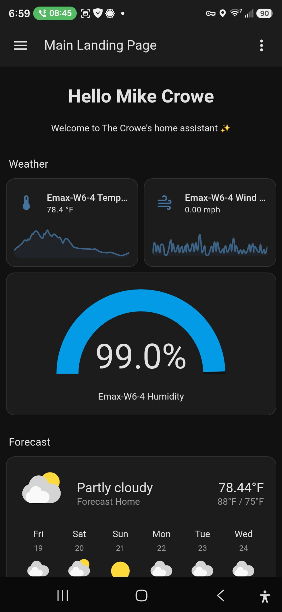
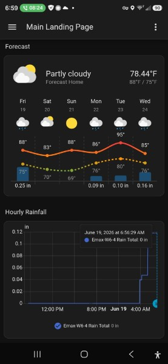

_This post was written with AI assistance (Claude) for structure and formatting. The hardware choices, the frustration, and the opinions are entirely my own._

---

**Part 1 of 2: Fun with Home Assistant**

**Series Overview:**
- **Part 1:** Pulling My Weather Station into Home Assistant with a $40 USB Radio *(you are here)*
- **Part 2:** [Auto-Switching My Fire TV's HDMI Input from a USB Switch](/posts/2026-06-19-fun-with-home-assistant-part-2-hdmi-switching/) - ADB keycodes, a webhook, and udev bugs

---


Here's the embarrassing truth:

> **I bought a $40 USB radio because I was too lazy to walk across the house.**

That's the whole origin story. I have a perfectly good 6-in-1 outdoor weather station. It has temperature, humidity, wind speed, wind direction, and a rain gauge. It works great. The problem is the way I'm supposed to read it: walk over to a little LCD base station, squint at it, and (if I want anything beyond the current temperature) start mashing buttons to cycle through screens.

And I can never find the right button. I want last week's rainfall, I press something, and now I've somehow changed the altitude calibration or flipped it to Celsius. What a PITA.

What I really wanted was the data *in Home Assistant*, on the same dashboard I already stare at every morning. I wanted something smarter, but I wasn't willing to pay for one of the fancy Wi-Fi/cloud weather stations to get there. I already own a perfectly good set of sensors. They're just broadcasting into the void.

## The Sensors Were Already Shouting, I Just Wasn't Listening

What took me embarrassingly long to internalize: my weather station already broadcasts everything wirelessly. That's how the outdoor unit talks to the indoor LCD base station. It's sitting out there transmitting temperature, humidity, wind, and rain over the air on 433.92 MHz, several times a minute, for free.

The LCD base station isn't doing anything magic. It's just a radio receiver with a screen bolted on. So if I could get *my own* radio receiver listening on that frequency, I could decode the exact same packets and skip the screen-with-the-cursed-buttons entirely.

That's where the cheap-USB-radio rabbit hole begins.

## The Hardware: One $40 Dongle

The piece that makes this whole thing work is an **RTL-SDR**, a software-defined radio. Originally these chips shipped inside USB TV tuners; someone figured out you could repurpose them to listen to huge swaths of radio spectrum, and a whole hobby was born.

I bought the one everybody recommends for this:

- **Nooelec NESDR Mini 2+** — 0.5 PPM TCXO RTL-SDR & ADS-B USB receiver set, with antenna, mount, and a female SMA adapter. RTL2832U demodulator + R820T2 tuner.

That's it. That's the hardware budget. A ~$40 dongle that plugs into a USB port and can listen to 433MHz (and a pile of other stuff; ADS-B aircraft tracking is the other classic use, but that's a different post).

The 0.5 PPM TCXO part matters more than it sounds: it's a temperature-compensated oscillator, which means the tuner doesn't drift as it warms up. Cheaper SDRs wander off-frequency and you spend your evening chasing the signal. Spend the extra few dollars.

## The Naive Version (a.k.a. "How Hard Could This Be?")

My first mental model was: "I'll just install some SDR app, point it at 433MHz, and read the numbers." 

This is technically true and completely useless. Raw SDR output is a firehose of radio noise. You can *hear* your weather station in there, but a stream of I/Q samples is not "78.4°F." Something has to know the specific modulation and packet format your particular station uses and turn those bursts into structured readings.

That something is **`rtl_433`**, an open-source decoder that knows the protocols for hundreds of cheap 433MHz devices (weather stations, tire-pressure sensors, doorbells, soil probes, you name it). This is the piece that does the real work, and getting Home Assistant to consume its output cleanly was the actual project.

Here's the pipeline I landed on:

```
Outdoor sensors  ──433.92MHz──▶  RTL-SDR dongle
                                      │
                                      ▼
                                  rtl_433  (decode RF → JSON)
                                      │  publish
                                      ▼
                                  MQTT broker (Mosquitto)
                                      │  auto-discovery
                                      ▼
                                  Home Assistant entities
```

Three moving parts: `rtl_433` to decode, Mosquitto as the MQTT broker to carry the messages, and an auto-discovery helper so Home Assistant registers each sensor automatically instead of me hand-defining every entity. I run all three as Docker containers on my Synology/Linux host, with the dongle passed through to the container.

## The Working Setup

### The Docker stack

This is the compose file that ties the three containers together. The dongle gets passed into the `rtl_433` container via `/dev/bus/usb`, and everything talks over a shared Docker network:

```yaml
version: '3.8'

networks:
  proxy:
    name: proxy
    external: true

services:
  # MQTT Broker for message distribution
  mosquitto:
    image: eclipse-mosquitto:latest
    container_name: mosquitto
    restart: unless-stopped
    ports:
      - "1883:1883"
    volumes:
      - /root/docker/config/mosquitto/config/mosquitto.conf:/mosquitto/config/mosquitto.conf:ro
      - /root/docker/config/mosquitto/data:/mosquitto/data
      - /root/docker/config/mosquitto/log:/mosquitto/log
    networks:
      - proxy

  # SDR service: listens to RF and publishes to MQTT
  rtl_433:
    image: hertzg/rtl_433:latest
    container_name: rtl_433
    restart: unless-stopped
    devices:
      - /dev/bus/usb:/dev/bus/usb
    # -R 215 activates decoding for my weather station's protocol
    command: >
      -C si
      -f 433.92M
      -R 215
      -F "mqtt://mosquitto:1883,retain=1,devices=rtl_433/EM3390D/devices[/type][/model][/subtype][/channel],events=rtl_433/EM3390D/events"
    depends_on:
      - mosquitto
    networks:
      - proxy

  # Auto-discovery: registers entities in Home Assistant
  rtl_433_autodiscovery:
    build:
      context: .
      dockerfile: Dockerfile
    container_name: rtl_433_autodiscovery
    restart: unless-stopped
    depends_on:
      - mosquitto
      - rtl_433
    command: >
      -H mosquitto
      -p 1883
      -R "rtl_433/EM3390D/events"
      -D homeassistant
      -i 600
      -T "devices[/type][/model][/subtype][/channel]"
    networks:
      - proxy
```

Two flags in the `rtl_433` command are worth calling out, because they're where I burned the most time:

- **`-f 433.92M`** tunes the radio to the frequency the station actually transmits on. Get this wrong and you'll hear nothing.
- **`-R 215`** explicitly enables the decoder for my station's protocol. By default `rtl_433` tries to auto-detect everything, which mostly works. But pinning the exact protocol number made the readings rock-solid and cut out spurious decodes from the neighbors' devices.

The trick to figuring out that protocol number: run `rtl_433` once with no `-R` filter and just watch the console. It prints every device it decodes, including the model name and protocol ID. Find your station in the firehose, note the number, then pin it. (Claude plus a few "rtl_433 weather station protocol" searches saved me a *lot* of trial and error here — this is exactly the kind of obscure-but-documented thing an LLM is great at narrowing down.)

### Letting Home Assistant find the sensors

The `rtl_433_autodiscovery` container is the quality-of-life piece. It watches the MQTT events topic and publishes Home Assistant **MQTT discovery** messages, so each sensor (temperature, humidity, wind average, wind direction, rain) shows up automatically as its own entity. No hand-writing a YAML block per sensor.

Once Home Assistant is pointed at the same Mosquitto broker on port `1883`, the entities just appear:

- `sensor.emax_w6_4_temperature`
- `sensor.emax_w6_4_humidity`
- `sensor.emax_w6_4_wind_speed`
- `sensor.emax_w6_4_wind_direction`
- `sensor.emax_w6_4_rain_total`

### Making it look like a real weather card

Individual sensor entities are fine, but Home Assistant has a proper `weather` card type that draws the nice forecast strip. So I stitched my live local sensors together into a template weather entity that lays my real outdoor readings on top of the regional forecast for the multi-day outlook:

```yaml
template:
  - weather:
      - name: "Local Weather Station"
        unique_id: "local_weather_station"
        condition_template: "{{ states('weather.forecast_home') }}"
        temperature_template: "{{ states('sensor.emax_w6_4_temperature') | float(0) }}"
        humidity_template: "{{ states('sensor.emax_w6_4_humidity') | int(0) }}"
        wind_speed_template: "{{ states('sensor.emax_w6_4_wind_speed') | float(0) }}"
        wind_bearing_template: "{{ states('sensor.emax_w6_4_wind_direction') | float(0) }}"
        temperature_unit: "°F"
        wind_speed_unit: "mph"
        precipitation_unit: "in"
        visibility_unit: "mi"
        pressure_unit: "inHg"
        forecast_daily_template: "{{ state_attr('weather.forecast_home', 'forecast') }}"
```

The trick here: the current conditions (temperature, humidity, wind) come from *my* sensors sitting in my actual yard, while the multi-day forecast is pulled from `weather.forecast_home`. I get my hyper-local "what is it doing right now" plus a real forecast, in one card.

## The Payoff

Here's the dashboard I now glance at instead of walking across the house:



That humidity gauge reading 99% is real, by the way. It had just rained. Temperature, a live wind sparkline, the humidity dial, and the forecast card all on one screen, updating in real time from my own sensors.

But the part that delighted me is the rainfall tracking:



I get two rainfall views now:

- Hourly rainfall: how much we've gotten recently, so I can see at a glance whether I need to water anything.
- Monthly rainfall: accumulation over time, so I can track the long-term wet-or-dry trend.

We've been in a stretch where I actually care whether it's been raining, and being able to *see the trend* instead of guessing is the whole reason this was worth doing. Yes, technically I could have walked to the LCD base station, found the right button (good luck), and cycled to the rainfall history screen. But I'd inevitably fat-finger the config instead, and I'd only get a number, not a graph I can actually read a trend off of.

The wind and humidity being a quick glance away is just a bonus. Watching the wind sparkline jitter during a storm is more fun than it has any right to be.

## Reflection: What This Cost Me (and What It Didn't)

**What I gave up:**

- It's not plug-and-play. A $40 dongle plus three Docker containers is more setup than buying a cloud weather station and scanning a QR code. If you're allergic to YAML, this isn't your weekend.
- The protocol hunt is real. Figuring out `-f 433.92M` and `-R 215` for *your specific* hardware takes some console-watching and searching. My numbers won't be your numbers.
- The forecast is still regional. My template entity uses my real sensors for current conditions but leans on `weather.forecast_home` for the multi-day outlook. I'm not predicting the weather from my backyard. I'm just measuring it accurately.
- No cloud account, no vendor app, no weather history living on someone else's server. That's a feature to me, but if you want a slick phone app maintained by a vendor, this isn't that.

**What I gained:**

- Real, local, real-time conditions in the dashboard I already use, with no walking and no buttons.
- Rainfall graphs I'll actually look at, both short-term and long-term.
- No new subscription, no cloud dependency, and sensors I already owned finally doing something useful.
- A genuinely fun excuse to learn what an RTL-SDR can do (spoiler: a *lot* more than weather; that dongle can also track aircraft, which is foreshadowing).

For forty bucks and an evening of fiddling, I turned a one-way LCD I resented into a live data feed I enjoy. That's a great trade.

## Close

This is **Part 1** of my "Fun with Home Assistant" series. In [**Part 2**](/posts/2026-06-19-fun-with-home-assistant-part-2-hdmi-switching/), I wire a physical USB switch to my Fire TV so flipping between my work and home laptops auto-switches the HDMI input — an ADB, udev, and webhook rabbit hole that fought me much harder than this did.

If you want to replicate the weather setup, the tools doing the heavy lifting are all open source:

- [**rtl_433**](https://github.com/merbanan/rtl_433) — the RF decoder, and the star of the show
- [**Eclipse Mosquitto**](https://mosquitto.org/) — the MQTT broker
- [**Home Assistant MQTT discovery**](https://www.home-assistant.io/integrations/mqtt/#mqtt-discovery) — how the sensors auto-register

_Have your own cheap-SDR or Home Assistant war stories? Hit me up on [GitHub](https://github.com/drmikecrowe) or wherever you found this post._
